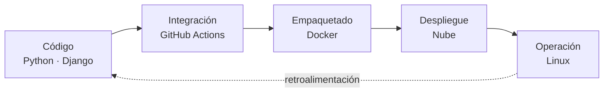

K&nbsp;A&nbsp;L&nbsp;I&nbsp;G&nbsp;A&nbsp;S&nbsp;J

# Gustavo Alexander Solís Jiménez

**Ingeniería en Sistemas Computacionales** — ITSC

Cloud · DevOps · Infraestructura · Backend

Diseño servicios backend y automatizo la infraestructura que los ejecuta: contenedores, integración continua y despliegue reproducible sobre Linux.

## Perfil

<table>
<tr>
<td width="33%" valign="top">

**Cloud e infraestructura**

Arquitectura y administración de servicios en la nube, contenedores y diseño de infraestructuras escalables.

</td>
<td width="33%" valign="top">

**Backend**

Servicios web, APIs REST y modelado de datos con Python y Django sobre PostgreSQL.

</td>
<td width="33%" valign="top">

**DevOps**

Integración y despliegue continuo, control de versiones y automatización de flujos de trabajo.

</td>
</tr>
</table>

## Stack

<table>
<tr>
<td valign="middle"><b>Backend</b></td>
<td valign="middle">

</td>
</tr>
<tr>
<td valign="middle"><b>Frontend</b></td>
<td valign="middle">

</td>
</tr>
<tr>
<td valign="middle"><b>Datos</b></td>
<td valign="middle">

</td>
</tr>
<tr>
<td valign="middle"><b>IA y agentes</b></td>
<td valign="middle">

</td>
</tr>
<tr>
<td valign="middle"><b>Nube</b></td>
<td valign="middle">

</td>
</tr>
<tr>
<td valign="middle"><b>Contenedores y virtualización</b></td>
<td valign="middle">

</td>
</tr>
<tr>
<td valign="middle"><b>Automatización y sistemas</b></td>
<td valign="middle">

</td>
</tr>
<tr>
<td valign="middle"><b>Documentación</b></td>
<td valign="middle">

</td>
</tr>
<tr>
<td valign="middle"><b>Entorno</b></td>
<td valign="middle"><code>CachyOS (Arch)</code> <code>Wayland</code> <code>fish</code> <code>BTRFS</code></td>
</tr>
</table>

## Cadena de entrega

Del código a la operación, con retroalimentación continua.

## Contacto

Abierto a colaborar en proyectos de código abierto y a conversar sobre Cloud, DevOps e infraestructura.

 

---

Infraestructura reproducible · Automatización · Software mantenible

